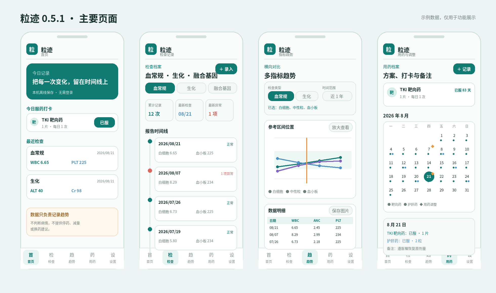
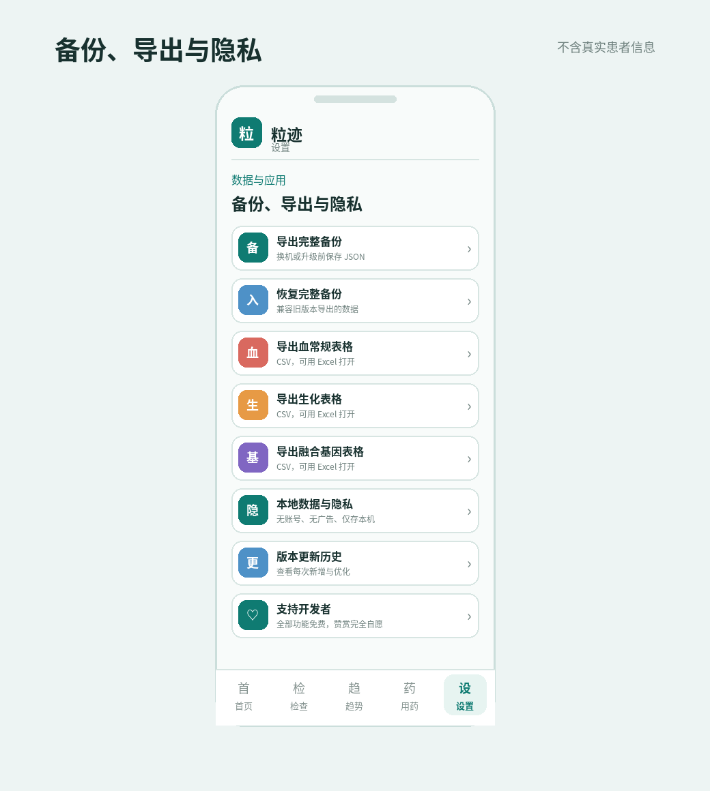

# 粒迹 0.5.1 使用说明

粒迹用于整理慢性粒细胞白血病随访中的血常规、生化、融合基因和用药记录。它帮助保存与查看数据，不替代医生诊断和治疗建议。

## 1. 第一次使用

1. 从本仓库 [Releases](../../releases/latest) 下载 APK 并安装。
2. 打开“检查”，分别录入已有的血常规、生化和融合基因记录。
3. 打开“用药”，登记正在服用的药物、开始日期、剂量和单位。
4. 回到首页完成当天服药打卡。
5. 在“设置”中导出一次完整备份，并保存到可信位置。

旧版本升级时请直接覆盖安装，不要先卸载。覆盖安装前建议先导出完整备份。

## 2. 录入检查报告

### 图片识别

进入“检查”，点血常规、生化或融合基因卡片上的“记录”，再选择报告截图。识别完成后请对照原报告检查日期、结果、参考范围和单位，再保存。

本地 OCR 仍不完善，模糊图片、压缩图片、特殊版式或小数点过淡时可能识别失败。遇到这种情况，可以把报告图片交给豆包整理成文本，再复制到粒迹的“文本录入”中。可以直接使用下面这段提示词：

> 请识别这张血常规/生化报告，把每项整理为：指标名称｜结果｜参考下限｜参考上限｜单位。不要分析病情，不要省略小数点，不要猜测看不清的数字；看不清请标记“待核对”。

把报告交给任何第三方工具前，建议先遮挡姓名、病历号、就诊卡号、条码和身份证号等个人信息。即使使用文字录入，保存前仍应逐项核对。

### 同院参考范围

粒迹会优先读取报告上印刷的参考范围；开启“同院参考范围复用”后，同一检查机构再次录入时可沿用上次范围。若医院、院区、检测方法或人群范围改变，请以本次原报告为准。

## 3. 查看记录与趋势

- 在“检查”页点某次记录，可查看完整结果和异常项。
- 在“趋势”页选择检查类型、指标和时间范围，可查看曲线与对应日期的数据表。
- 点“放大查看”会打开更大的查看层，不再强制把手机切成横屏。
- 数据表支持保存为图片，便于复诊时查看；分享前请确认图片中没有不希望公开的健康信息。
- 融合基因页中的阶段说明和理想范围只用于记录参考，不能据此自行停药、减量或换药。

## 4. 用药与日历

1. 在“用药”中登记药名、类型、每次剂量、单位和开始日期。
2. 每天实际服药后再打卡；日历只显示已经确认的用药记录。
3. 调整剂量或停药时新增一条调整记录，并填写生效日期和备注。
4. 点日历中的日期，可查看当天药物、剂量和调整备注。

停药日期之后不应继续显示该药物；如显示异常，请检查该药物的停用记录是否保存成功。

## 5. 备份、恢复与导出

- “导出完整备份”生成 JSON 文件，用于换机、重装或升级后恢复。
- “导入完整备份”会把备份中的检查、用药和设置恢复到应用中；导入前建议先备份当前数据。
- 血常规、生化和融合基因可分别导出 CSV 表格，并用 Excel 打开。
- 卸载应用或清除应用数据可能删除本机记录，因此应定期把备份复制到可信的其他设备或私人存储位置。

## 6. 常见问题

**为什么新版本安装后看起来仍是旧版？**  
确认下载的是 `Liji-CML-Tracker-0.5.1.apk`，并直接覆盖安装。若系统拒绝覆盖，通常是安装包签名不同；不要急着卸载，先从旧版导出完整备份。

**为什么 OCR 没有识别完整？**  
尽量使用未压缩、清晰、完整的原图。识别失败时改用“文本录入”，并按上面的提示词让豆包先整理文字。

**备份里含有什么？**  
备份可能包含健康检查和用药信息。不要上传到公开群聊、公开网盘或公共代码仓库。

## 7. 支持与版权

粒迹的全部功能均可免费使用。如果它对您有所帮助，并愿意支持后续维护，可以自愿赞赏开发者。赞赏与功能、更新和服务权益无关，请根据个人情况量力而行。

© 2026 粒迹开发者。保留所有权利。未经书面许可，不得复制、修改、反编译后重新发布，不得将本软件界面、图标、文案或程序用于其他商业产品。
